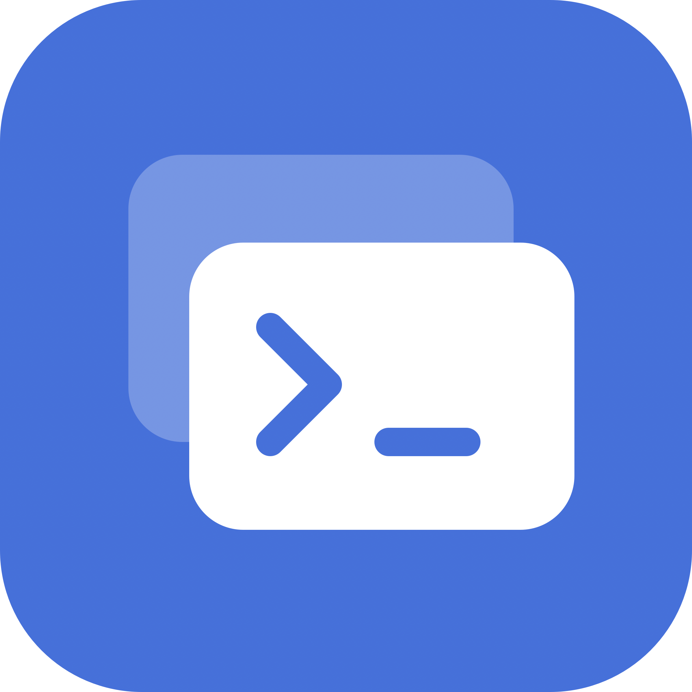
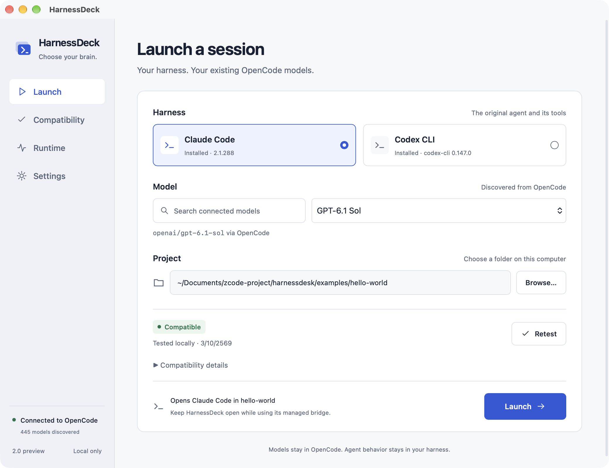
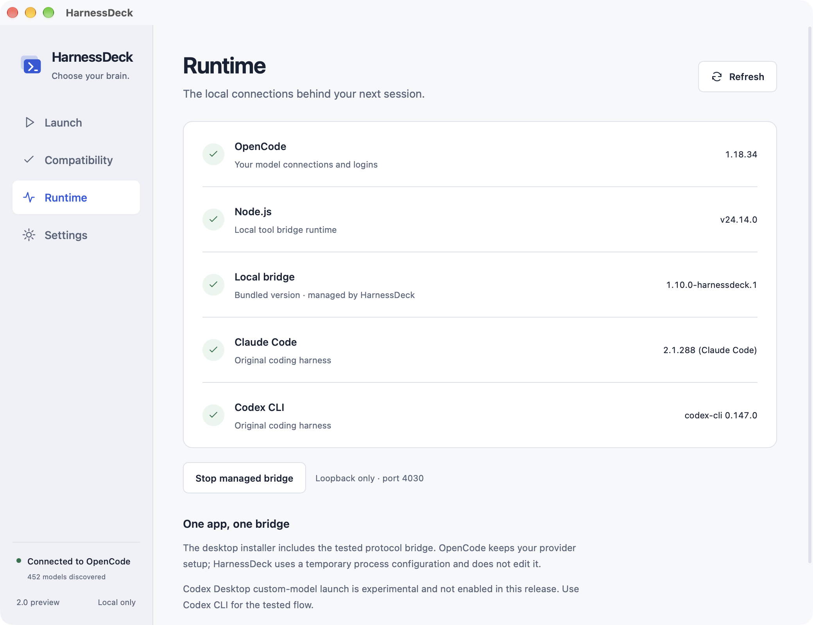

<div align="center">



# HarnessDeck

### Your ChatGPT subscription. Claude Code’s harness.

Use Claude Code or Codex CLI with models you already connected to OpenCode, including your existing ChatGPT subscription connection.

**[Download the macOS preview](https://github.com/xArmeriumx/harnessdeck-releases/releases/tag/v2.0.0-preview.1)**



</div>

*Launch screen captured from the actual release application on macOS, using a sample project and a real local workflow result.*

This repository provides public installers and release notes. Application source is maintained in a separate private repository. Downloads do not require repository access or a GitHub account.

## Requirements

- macOS 13 or later on **Apple Silicon**.
- [OpenCode](https://opencode.ai/docs/) with a working model/provider login.
- [Node.js 20.19 or later](https://nodejs.org/en/download).
- [Claude Code](https://code.claude.com/docs/en/overview) or [Codex CLI](https://developers.openai.com/codex/cli/).

This preview is **ad-hoc signed, not Apple-notarized**. Gatekeeper may require **System Settings → Privacy & Security → Open Anyway** after the first launch attempt.

## Install and launch

1. Confirm your selected model works inside OpenCode first.
2. Download the DMG, open it, and drag **HarnessDeck.app** into Applications. Alternatively, extract the zipped app.
3. Open HarnessDeck and choose **Claude Code** or **Codex CLI**.
4. Choose a model and browse to your project folder.
5. Optionally run **Test workflow**, then select **Launch**.

The local bridge is included and starts automatically. Keep HarnessDeck open while the terminal session uses its managed bridge. Provider logins stay in OpenCode; project trust, tools, permissions and skills stay in the original harness.

**Test workflow** uses an isolated temporary fixture and consumes the selected provider's allowance. It does not test against your project files. Compatibility results describe the tested combination, not every model or large-project workflow.

## Inside the app

The Runtime screen shows detected tools and the bundled bridge managed by HarnessDeck.



*Runtime capture is from the packaged QA build of the same interface, using real native detection. Versions, model counts and compatibility results reflect the capture environment and can differ on your Mac.*

## Release assets

| File | Purpose |
|---|---|
| `HarnessDeck_2.0.0_aarch64.dmg` | macOS Apple Silicon installer |
| `HarnessDeck_2.0.0_aarch64.app.zip` | The same application as a ZIP |
| `SHA256SUMS.txt` | SHA-256 hashes for both downloads |

To verify both downloaded files, run this in the folder containing all three assets:

```bash
shasum -a 256 -c SHA256SUMS.txt
```

## Preview scope

The macOS package has been locally validated, including a real native Claude/GPT workflow. Codex Desktop custom-model launch is disabled in this preview. Windows, Linux and Intel macOS installers are not provided. Advanced subagent/context acceptance and universal long-task compatibility are not claimed. Model access, subscriptions and quotas remain controlled by the provider.

## Attribution

HarnessDeck is MIT-licensed; see [LICENSE](LICENSE). Its bundled bridge is based on [KochC/opencode-llm-proxy](https://github.com/KochC/opencode-llm-proxy), with the original MIT license included in application resources.

HarnessDeck is independent software, not an official OpenAI, Anthropic or Anomaly product.
